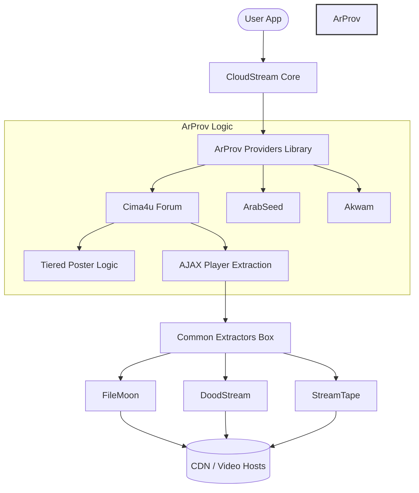

# 🎬 ArProv - Professional Arabic CloudStream Extensions

<p align="center">
  
  
  
</p>

<p align="center">
  <strong>The Gold Standard for Arabic Content on CloudStream. Clean, High-Performance, and Community-Driven.</strong>
</p>

---

## 🏗️ System Architecture

ArProv is designed with a modular architecture that separates content sourcing (Providers) from video link retrieval (Extractors). This ensures maximum stability and easy maintenance.



---

## 🚀 Key Features

*   🛡️ **Tiered Poster Extraction**: proprietary logic to ensure 100% catch rate for movie posters using local UI scoping and safe meta-tag fallbacks.
*   ⚡ **AJAX Player Retrieval**: Direct communication with server backends (`admin-ajax.php`) to bypass obfuscated frontend code.
*   🌍 **Universal Compatibility**: Optimized for Android, Android TV, and Web interfaces.
*   💎 **Premium Quality**: Support for multi-resolution streaming (4K, 1080p, 720p).

---

## 📦 Extension Directory

### ✅ Active & Optimized
| Provider | Genre | Package Name |
| :--- | :--- | :--- |
| **Cima4u Forum** | Premium Movies/Series | `com.lagradost.cloudstream3.cima4uforum` |
| **ArabSeed** | Movies & Series | `com.lagradost.cloudstream3.arabseed` |
| **Akwam** | General Entertainment | `com.lagradost.cloudstream3.akwam` |
| **FaselHD** | Arabic & International | `com.lagradost.cloudstream3.faselhd` |
| **Anime4up** | Anime & Movies | `com.lagradost.cloudstream3` |
| **Animeiat** | Dedicated Anime | `com.lagradost.cloudstream3.animeiat` |
| **MovizLand** | Movies & Series | `com.lagradost.cloudstream3.movizlands` |
| **Cima4U** (Working) | Movies & Series | `com.lagradost.cloudstream3.cima4u` |
| **CimaClub** (Working) | Movies & Series | `com.lagradost.cloudstream3.cimaclub` |
| **CimaLeek** (New) | Movies & Series | `com.lagradost.cloudstream3.cimaleek` |
| **QisatTv** (Development) | Movies & Series | `com.lagradost.cloudstream3.qisat` |

### 🛠️ In Development (Coming Soon)
- [ ] **EgyBest** - `Legacy Porting`
- [ ] **MyCima** - `Architecture Alignment`


- [ ] **CimaNow** - `Development`
- [ ] **Shahid4u** - `Maintenance`
- [ ] **RistoAnime** - `Development`
- [ ] **Fushaar** - `Planned`
- [ ] **GateAnime** - `Planned`

### 🚫 Blocked by Cloudflare
The following providers are currently inaccessible due to high-security Cloudflare protection.
- [ ] **AnimeBlkom** - `Pending Bypass Research`

---

## 🔧 Installation & Setup

### Instant Repositories
You can use the **shortcode** directly in CloudStream:
```text
arprov
```

Or copy and paste this URL into your CloudStream settings:

```text
https://raw.githubusercontent.com/ramailo1/arprov/main/repo.json
```

### Manual Build
```bash
./gradlew build
```

---

## 📝 Attribution & Legal

> [!NOTE]
> This project is a refined fork of [dhomred/cloudstream-extensions-arabic-v2](https://github.com/dhomred/cloudstream-extensions-arabic-v2).
> Re-architected and maintained by **ramailo1**.

Distributed under the **MIT License**. See [LICENSE](LICENSE) for more information.

---

<p align="center">
  ⭐ <strong>Support our work by starring this repository!</strong> ⭐
</p>