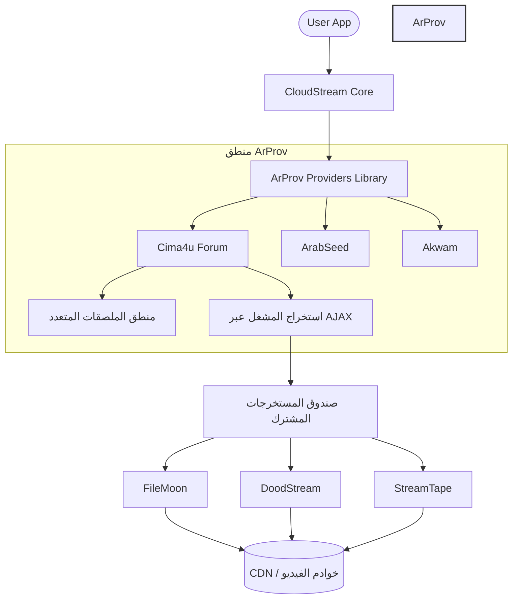

# 🎬 ArProv - إضافات كلاود ستريم عربية احترافية

<p align="center">
  
  
  
</p>

<p align="center">
  <strong>المعيار الذهبي للمحتوى العربي على كلاود ستريم. نظيف، عالي الأداء، ومدعوم من المجتمع.</strong>
</p>

<p align="center">
  <strong>العربية</strong> | <a href="README_EN.md"><strong>English</strong></a>
</p>

## 📊 الإحصائيات
- **المواقع النشطة**: 21+ موقع
- **المستخرجات**: 15+ مستخرج
- **اللغات**: العربية والإنجليزية
- **الجودة**: 4K، 1080p، 720p

---

## 🏗️ هندسة النظام

تم تصميم ArProv بهندسة معيارية تفصل بين جلب المحتوى (Providers) وبين استخراج روابط الفيديو (Extractors). يضمن ذلك أقصى قدر من الاستقرار وسهولة الصيانة.



---

## 🚀 المميزات الرئيسية

*   🛡️ **استخراج الملصقات المتدرج**: منطق خاص لضمان معدل التقاط 100% لملصقات الأفلام باستخدام نطاق واجهة المستخدم المحلي وبدائل العلامات الوصفية الآمنة.
*   ⚡ **استرجاع المشغل عبر AJAX**: التواصل المباشر مع واجهات الخادم الخلفية (`admin-ajax.php`) لتجاوز أكواد الواجهة الأمامية المعقدة.
*   🌍 **توافق عالمي**: محسن لواجهات Android و Android TV و الويب.
*   💎 **جودة ممتازة**: دعم البث المتعدد الدقة (4K, 1080p, 720p).

---

## 📦 دليل الإضافات

> [!IMPORTANT]
> **تحقق من الحالة**: جميع الإضافات المذكورة أدناه تعمل بكامل طاقتها ومحسنة، باستثناء تلك المذكورة في قسم **المحظورة / غير العاملة**.

### ✅ نشطة ومحسنة
| الإضافة | النوع | اسم الحزمة |
| :--- | :--- | :--- |
| **Cima4u Forum** | أفلام ومسلسلات مميزة | `com.lagradost.cloudstream3.cima4uforum` |
| **ArabSeed** | أفلام ومسلسلات | `com.lagradost.cloudstream3.arabseed` |
| **Akwam** | ترفيه عام | `com.lagradost.cloudstream3.akwam` |
| **FaselHD** | عربي وعالمي | `com.lagradost.cloudstream3.faselhd` |
| **Anime4up** | أنمي وأفلام | `com.lagradost.cloudstream3` |
| **Animeiat** | أنمي متخصص | `com.lagradost.cloudstream3.animeiat` |
| **MovizLand** | أفلام ومسلسلات | `com.lagradost.cloudstream3.movizlands` |
| **Cima4U** | أفلام ومسلسلات | `com.lagradost.cloudstream3.cima4u` |
| **CimaClub** | أفلام ومسلسلات | `com.lagradost.cloudstream3.cimaclub` |
| **CimaLeek** | أفلام ومسلسلات | `com.lagradost.cloudstream3.cimaleek` |
| **CimaNow** | أفلام ومسلسلات | `com.lagradost.cloudstream3.cimanow` |
| **QisatTv** | مسلسلات وقصص | `com.lagradost.cloudstream3.qisat` |
| **Fushaar** | أفلام ومسلسلات | `com.lagradost.cloudstream3.fushaar` |
| **EgyBest** | أفلام ومسلسلات | `com.lagradost.cloudstream3.egybest` |
| **EgyDead** | أفلام ومسلسلات | `com.lagradost.cloudstream3.egydead` |
| **MyCima** | أفلام ومسلسلات | `com.lagradost.cloudstream3.mycima` |
| **Shahid4u** | أفلام ومسلسلات | `com.lagradost.cloudstream3.shahid4u` |
| **GateAnime** | أنمي وأفلام | `com.lagradost.cloudstream3.gateanime` |
| **RistoAnime** | أنمي متخصص | `com.lagradost.cloudstream3.ristoanime` |
| **TopCinema** | أفلام، مسلسلات وأنمي | `com.lagradost.cloudstream3.topcinema` |
| **Tuk Tuk Cinema** | أفلام ومسلسلات | `com.lagradost.cloudstream3.tuk` |

> [!NOTE]
> **Fushaar**: قد تفتقد بعض الملصقات. هذه مشكلة من الموقع المصدر وليس من الإضافة.

> [!TIP]
> **رمضان 2026**: يتوفر الآن مسلسلات رمضان 2026 على إضافتي **CimaNow**، **ArabSeed** و **TopCinema**. قم بتحميلهما لمشاهدة أحدث المحتويات الرمضانية!

### 🛠️ قيد التطوير (قريباً)
- [ ] **Extra Sourced Providers** - `أفلام ومسلسلات`
> [!TIP]
> **هل لديك اقتراح؟** إذا كنت ترغب في رؤية موقع معين مضافاً كإضافة، تفضل بفتح "Issue" أو تواصل معنا!
### 🚫 محظورة / لا تعمل
هذه الإضافات محظورة حالياً من قِبل مواقعها (مثلاً: حماية Cloudflare، الحظر الجغرافي) أو تعاني من مشاكل كبيرة.

| الإضافة | السبب | الحالة |
| :--- | :--- | :--- |
| **AnimeBlkom** | حظر Cloudflare | `Disabled` |
| **FajerShow** | حظر Cloudflare | `Disabled` |
| **ShahidMBC** | حظر جغرافي / DRM | `Disabled` |

---

## 🔧 التثبيت والإعداد

> [!IMPORTANT]
> **مكون مطلوب**: يجب عليك تثبيت إضافة **Extractors** من هذا المستودع. تعتمد معظم الإضافات (مثل Fushaar و Akwam وغيرها) على صندوق المستخرجات المشترك لجلب روابط الفيديو. بدونها، ستظهر لك رسالة "No link found".

### المستودعات الفورية
يمكنك استخدام **الكود المختصر** (shortcode) مباشرة في CloudStream:
```text
arprov
```

أو انسخ هذا الرابط والصقه في إعدادات مستودعات CloudStream:

```text
https://raw.githubusercontent.com/ramailo1/arprov/main/repo.json
```

### البناء اليدوي
```bash
./gradlew build
```

---

## 📝 الحقوق والمسؤولية القانونية

> [!NOTE]
> هذا المشروع هو نسخة محسنة ومطورة من [dhomred/cloudstream-extensions-arabic-v2](https://github.com/dhomred/cloudstream-extensions-arabic-v2).
> تمت إعادة الهيكلة والصيانة بواسطة **ramailo1**.

## 🏆 لوحة الشرف
نكرم العقول المبدعة التي ساهمت في نجاح ArProv.

| المساهم | الإنجاز | الأثر |
| :--- | :--- | :--- |
| **[Abodabodd](https://github.com/Abodabodd)** | **منطق تجاوز الحماية والخوادم** | فتح إمكانيات إضافة `CimaNow`. |
| **[dhomred](https://github.com/dhomred)** | **المعماري الأصلي** | مؤسس إضافات الإصدار الثاني (v2). |

هل تريد أن تكون هنا؟ أرسل إصلاحاً أو إضافة جديدة!

مرخص تحت رخصة **MIT**. راجع ملف [LICENSE](LICENSE) لمزيد من المعلومات.

---

<p align="center">
  ⭐ <strong>ادعم عملنا عبر وضع نجمة للمستودع!</strong> ⭐
</p>